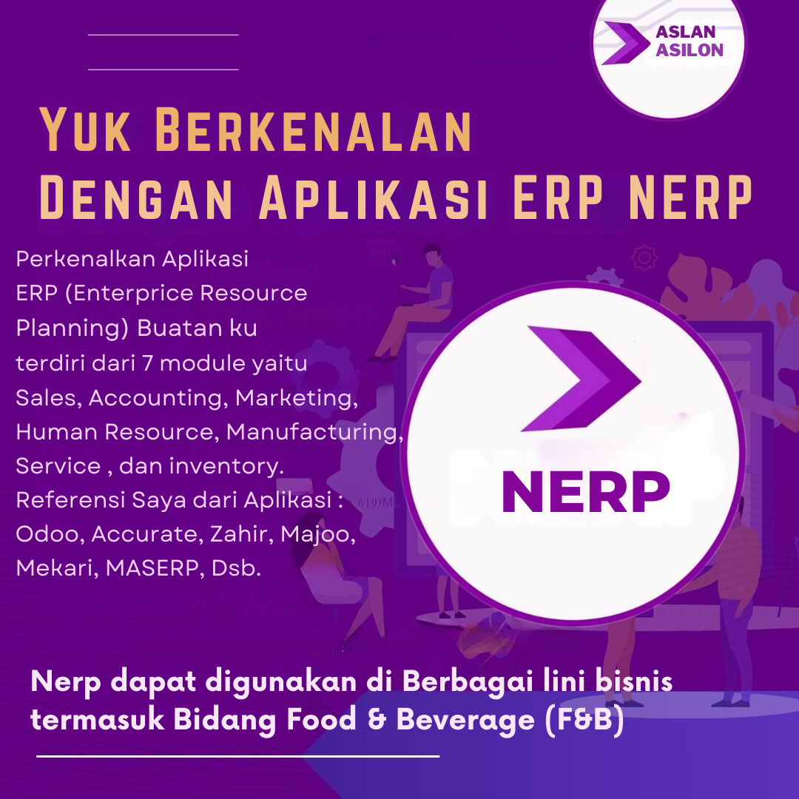
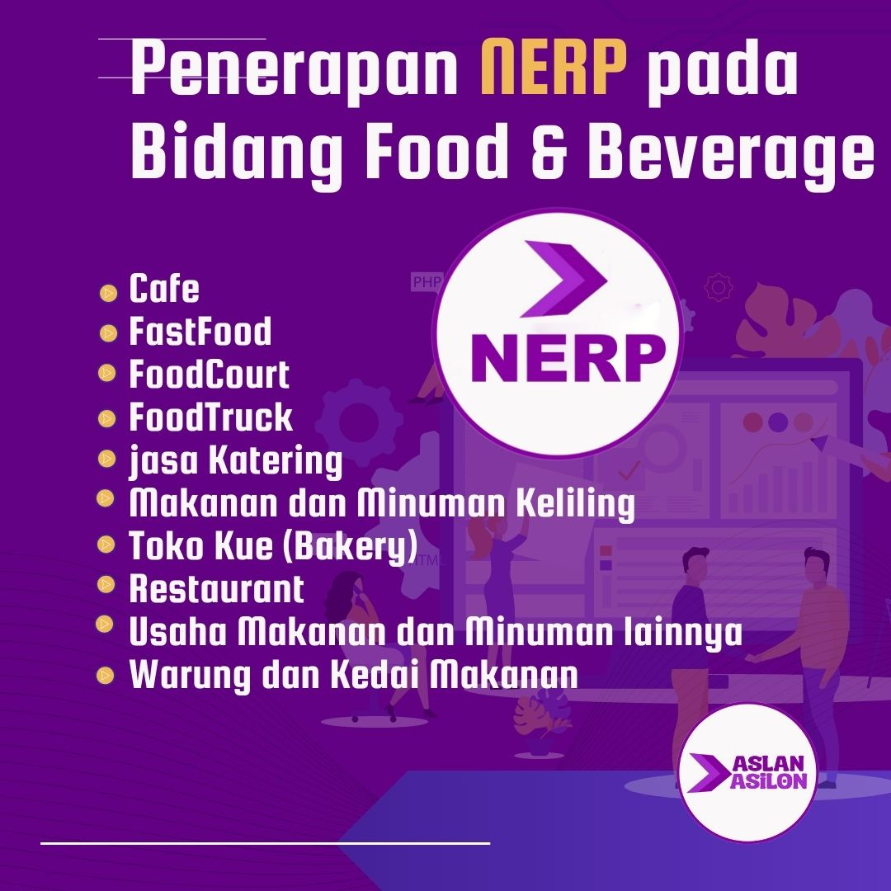
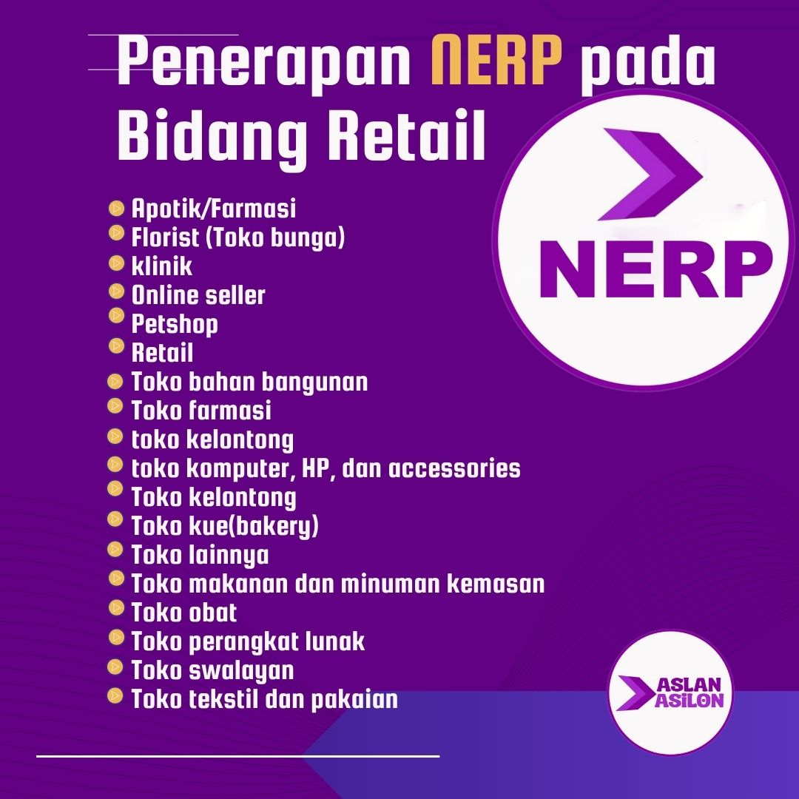
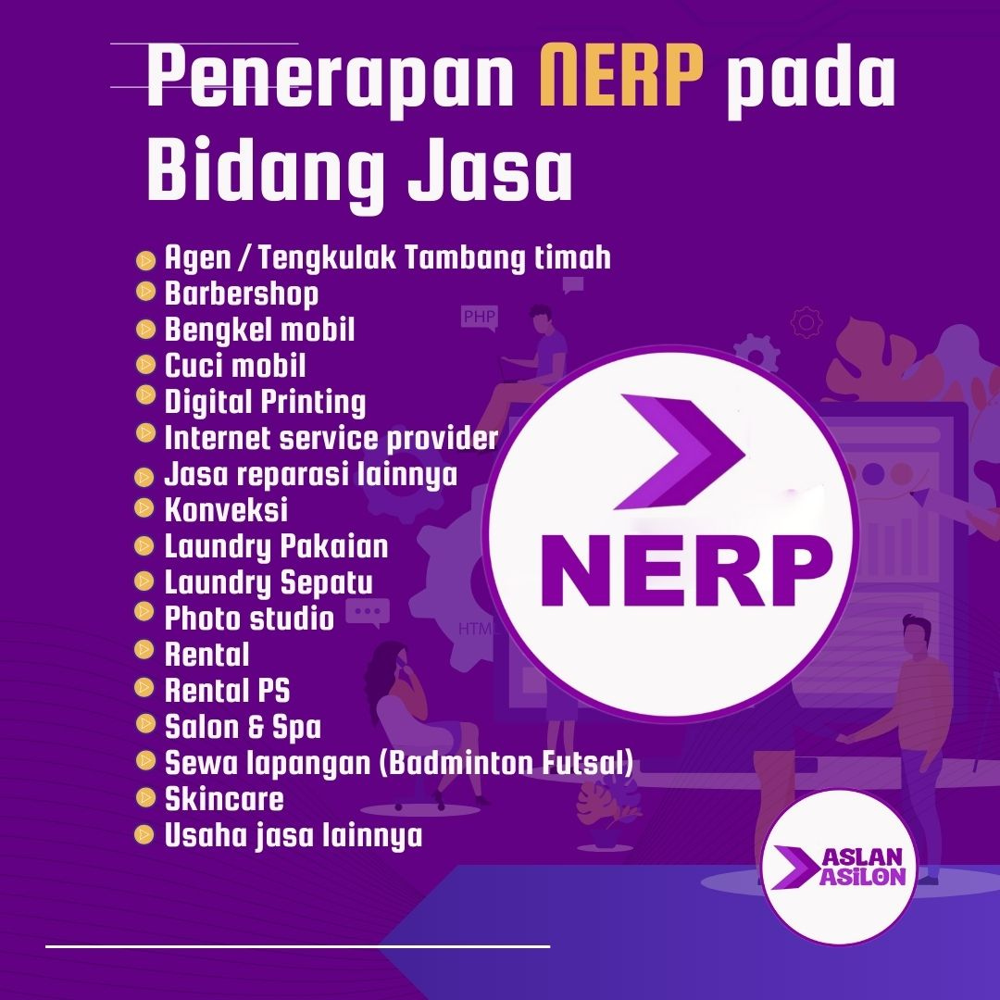

## NERP ERP adalah aplikasi ERP buatanku 

## Laravel 11
## Livewire

  
  

  
  

Dengan Menggunakan halaman admin NERP(terdiri dari 7 modul : Accounting, Sales,Human resource, inventory, manufactures, marketing, services) yang sedang saya kembangkan untuk keperluan bisnis :

- Digital financial recorder, multinational and flexible transactions, and advanced production management
- Financial operational automation, managing multiple warehouses, and advanced financial analysis
- simple inventory management, complex product management, and complex warehouse management

Dengan Key Features :
- Purchase lifecycle (dari penawaran hingga pembayaran)
- consolidation of financial reports
- bill of materials and work order
- bank reconciliation, 
- transactions in 20+ foreign currencies,
- batch, expiry and serial number tracking 
- product and inventory management
- product bundling, fulfillment inbound & outbound
- asset management
- multi-layer approval
- custom dashboard

-------------- Detail module accounting features :

- accounting dashboard
- cash book
- revenue and revenue reconciliation.
memastikan bahwa data pendapatan penjualan yang tercatat dalam sistem akuntansi perusahaan sesuai dengan data yang tercatat dalam sumber lain, seperti laporan penjualan, faktur, atau laporan bank. Proses ini penting untuk memastikan akurasi laporan keuangan dan integritas data keuangan.

- expenses: expense, cost, recurring payment, partners, 

- financial report : journal report, balance sheet, income statement, general ledger, payable, receivable

- account list : account list and general journal .

-------------- Detail module inventory features :
- Dashboard Inventory
- Dwelling time ( order processing time report & product processing time report )
waktu yang dihabiskan untuk menyelesaikan suatu item atau order
- Product (item, combo/bundling, prices , product based on area/per product)
- management supplier,purchase, menu book, deposit, budget, category in inventory/warehouse
- service product and extra product
- management online vehicle price list, print barcode

ada 2 metode Perhitungan Persediaan/inventory di NERP
- metode average dan metode FIFO
- Notes: Jika Anda telah mencatat transaksi dengan metode FIFO, maka Anda sudah tidak dapat mengubahnya lagi ke metode Average. Begitu juga sebaliknya.

-------------- Detail module Sales features :
- dashboard sales
- sales report
- bestseller
- product sales
- category sales
- extra sales & sub extra sales
- customer list, customer group, special price group, custom data customer, roles
- online customers, vendor, activity log and activity type
- GDPR requests

-------------- Detail module Manufactures features :
- production bill of materials
- production work order list
- Production Account Mapping  and Inventory Account Mapping
mengatur dan mengelola akun-akun akuntansi yang terkait dengan proses produksi dan persediaan barang

-------------- Detail module Human resource features :
- Dashboard human resource
- management department, outlet, employee, attendances, leads, projects, absensi

-------------- Detail module Marketing features :
- management discounts, affiliates, newsletter, subscribers, campaigns, activity log

-------------- Detail module service features :
- content management : topics, message template, news item, news comments, blog posts,
  blog comment, polls, forums
- configuration : general setting all features in all module include language,
                  countries, currencies, payment method, tax provicer, shipping,POS
- system : system information, log, warnings, message queue, schedule task
- helps : service, reservation, and utilizations report 

# screenshoots
## Accounting

## Human Resource

## Inventory

## Manufacture

## Marketing

## Sales

## Service

## Welcome

